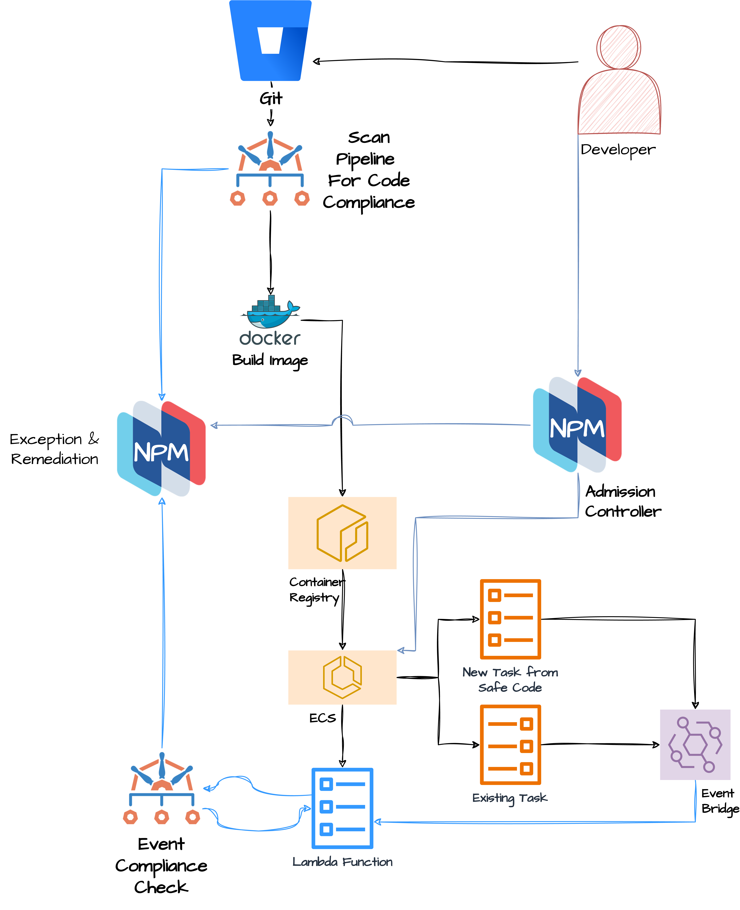

# ecs-resource-check-demo

Demo repo which holds materials to tell a complete ECS control story:
- [protection in repository](terraform/README.md) `terraform`
- [protection in cloud](nirmata-cloud-controller/README.md) `cloud-controller`
  - image verification on the fly
- [protection of existing resources](lambda/README.md) `lambda`
- [periodic scan of running ECS resources](cicd/README.md)
