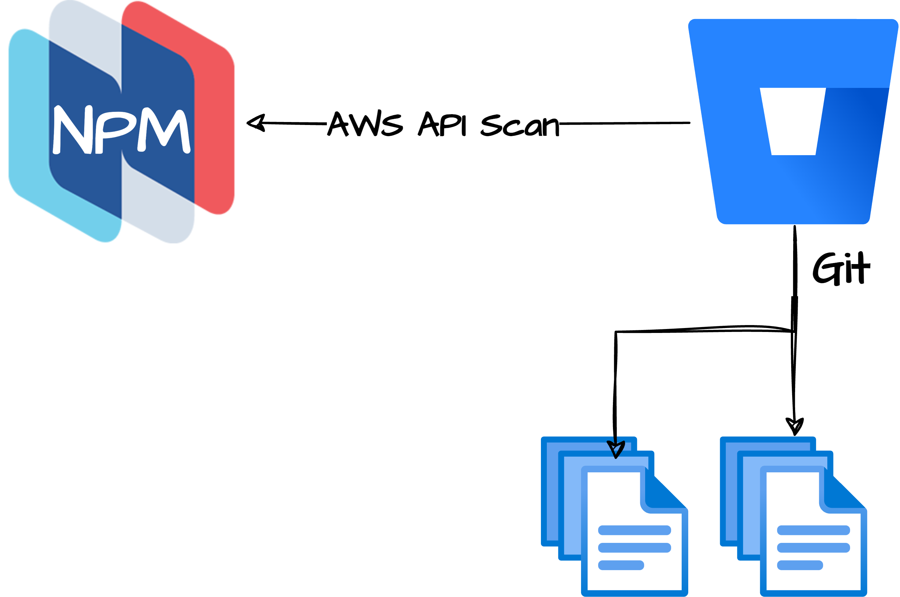

# Policies for CI/CD controls

This folder containers the policies which can be used with `nctl` to scan various resources from Jenkins, Github Actions, Gitlab, etc.

An example [Github Action](../.github/workflows/npm-periodic-ecs-scan.yaml) can be found in this repository.

