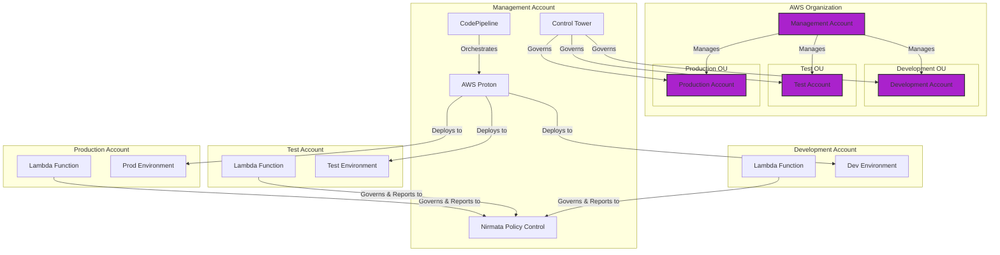
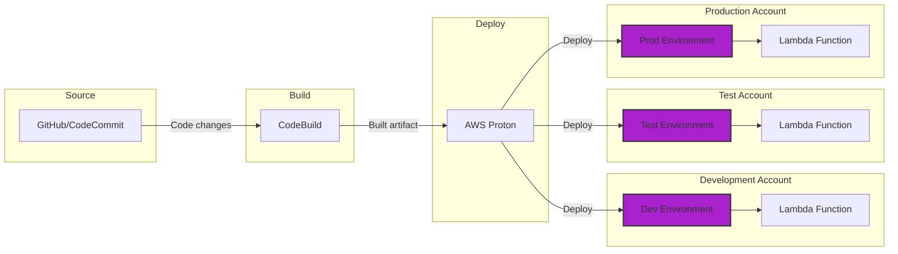

# AWS Multi-Account Research





## **Multi-Account AWS Lambda Deployment with AWS Proton**

### **1. Architecture Overview**
The goal is to set up a well-architected AWS Lambda function deployment pipeline across multiple AWS accounts using AWS Proton, Control Tower, and CodePipeline.

- **AWS Control Tower**: Helps automate the creation and governance of AWS accounts within an organizational structure.
- **AWS Proton**: Manages and simplifies infrastructure and service deployment, creating standardized environments across different accounts.
- **AWS CodePipeline**: Facilitates CI/CD processes, ensuring Lambda code is automatically tested, approved, and deployed across environments (development, testing, production).

### **2. Account Setup**
We will use a **multi-account strategy** to isolate the different stages of the deployment lifecycle (e.g., dev, test, prod). Each account will belong to its own Organizational Unit (OU) managed via AWS Control Tower:

- **Management Account (Proton Management)**: This account manages AWS Proton templates (environment and service templates) and provides infrastructure for other accounts. It serves as the "source of truth" for all infrastructure.
- **Development, Test, and Production Accounts**: These accounts host the deployed Lambda functions. Each account operates in its own sandbox, but the management account defines and provides the infrastructure.

AWS Proton uses **Environment Account Connections** to allow the management account to securely deploy infrastructure in the development/test/production accounts. This ensures bi-directional secure communication without the need for complex cross-account policies【[source](https://aws.amazon.com/blogs/architecture/simplifying-multi-account-ci-cd-deployments-using-aws-proton/)】【[source](https://aws.amazon.com/blogs/containers/multi-account-infrastructure-provisioning-with-aws-control-tower-and-aws-proton/)】.

### **3. CI/CD Pipeline with AWS CodePipeline**
**AWS CodePipeline** will manage code deployments across accounts. Code changes are automatically pushed through different stages:
1. **Source (e.g., CodeCommit or GitHub)**: The Lambda function code is stored in a repository.
2. **Build (CodeBuild)**: The code is packaged and prepared for deployment.
3. **Deploy (AWS Proton)**: AWS Proton deploys infrastructure templates that define the environment (e.g., networking, IAM policies) where the Lambda function will run.

**Service templates** within Proton define the Lambda service’s deployment configurations. These templates are reused across different environments, ensuring consistency. You can integrate **AWS CodeStar Connections** (e.g., with GitHub) to trigger deployment when changes are made to the Lambda code【[source](https://aws.amazon.com/blogs/containers/multi-account-infrastructure-provisioning-with-aws-control-tower-and-aws-proton/)】.

### **4. Step-by-Step Walkthrough**

1. **Set up Control Tower**:
   - Use Control Tower to create OUs and accounts for **Management**, **Development**, **Test**, and **Production**. These accounts will be isolated from one another.

2. **Define Environment and Service Templates in AWS Proton**:
   - Create environment templates in Proton, specifying network configurations, VPC settings, and IAM policies.
   - Service templates will define the Lambda function deployment, including roles, permissions, and monitoring tools (CloudWatch, X-Ray).
   - For example, the environment template could include VPC, subnets, and security groups, while the service template defines the Lambda service itself.

3. **Establish Environment Account Connections**:
   - Use the **Environment Account Connections** feature in Proton to allow the management account to provision infrastructure in the development/test/production accounts. Proton takes care of cross-account permissions using IAM roles【[source](https://aws.amazon.com/blogs/containers/multi-account-infrastructure-provisioning-with-aws-control-tower-and-aws-proton/)】.

4. **CI/CD Integration with AWS CodePipeline**:
   - Define a CodePipeline that pushes Lambda functions through different environments:
     - In the **development account**, functions are deployed and tested automatically.
     - After passing tests, the pipeline pushes the function to **test**, and then **production**, using AWS Proton templates for infrastructure provisioning【[source](https://aws.amazon.com/blogs/architecture/simplifying-multi-account-ci-cd-deployments-using-aws-proton/)】.

5. **Secure the Multi-Account Environment with SCPs**:
   - Use **Service Control Policies (SCPs)** to enforce organizational guardrails. For example, the management account may be allowed to deploy infrastructure in development and production accounts, but development accounts are prevented from making changes directly.
     ```json
     {
       "Version": "2012-10-17",
       "Statement": [
         {
           "Sid": "BlockProton",
           "Effect": "Deny",
           "Action": [
             "proton:*"
           ],
           "Resource": [
             "*"
           ]
         }
       ]
     }
     ```

6. **Monitoring and Logging**:
   - Use AWS CloudWatch and X-Ray to monitor Lambda execution, performance, and logs across accounts. Proton can provision these as part of the service templates, ensuring uniform monitoring across all environments.
