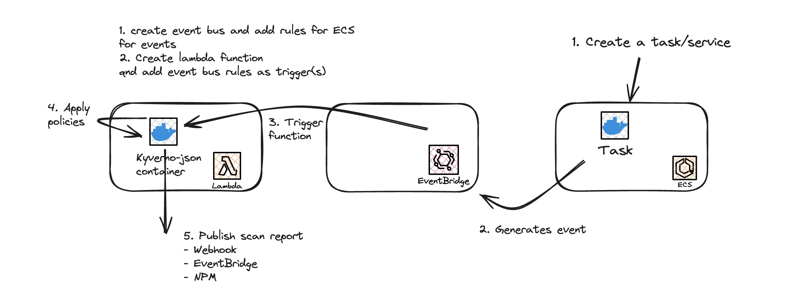

# Verifying AWS Service Configuration Using Kyverno JSON

Demo for applying policies using AWS lambda. It uses `kyverno-json` or `nctl` scan command to apply the policies to incoming events.

Use the image in AWS Lambda. For Slack integration, pass in the webhook url as an environment variable - WEBHOOK_URL

Add rules in Amazon EventBridge (default event bus) to forward events from `ecs` and `eks` to the lambda function.

