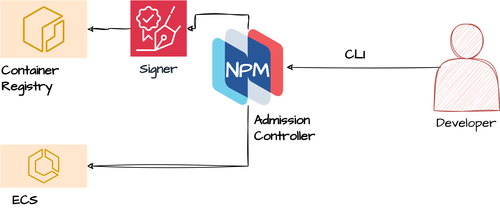

# Cloud Admission Controller

The cloud admission controller is a custom proxy server that intercepts and validates incoming requests to cloud services. It acts as a gatekeeper, enforcing specific policies and rules before allowing the requests to reach the cloud service provider.



## Installation

Using the helm chart, you can install the cloud admission controller in your Kubernetes cluster. The helm chart provides a convenient way to deploy the cloud admission controller with default configurations.

1. Create a Kind Kubernetes cluster using the following command:
```bash
kind create cluster
```

2. Install the Policy CRDs:
Two policy types are currently supported: Image Verification and Kyverno JSON policies to install them run the following commands:
```bash
kubectl apply -f nirmata-imageverfication-crd.yaml
kubectl apply -f nirmata-kyverno-json-crd.yaml
```

3. Install and configure the cloud admission controller:
```bash
helm install cloud-admission-controller ./charts/admission-controller --create-namespace --namespace nirmata
```

```bash
kubectl port-forward -n nirmata svc/cloud-admission-controller-service 8443:8443
```

4. In another terminal, setup and configure SSO for the AWS CLI. **NOTE** Not every organization uses SSO, skip this if you already have authentication setup:
```bash
aws configure sso
```

If it is already configured, you can run the following command to log in and obtain temporary credentials for using AWS CLI with SSO:
```bash
aws sso login
 ```

5. Set the environment variable `HTTPS_PROXY` to point to the cloud admission controller:
```bash
export HTTPS_PROXY=http://localhost:8443
```

6. The cert-manager will automatically create a secret with the CA certificate and key. You
can use the following command to get the CA certificate:
```bash
kubectl get secrets -n nirmata cloud-admission-controller-service.nirmata.svc.tls-ca -o jsonpath="{.data.tls\.crt}" | base64 --decode > ca.crt
```

Then, set the `AWS_CA_BUNDLE` environment variable to point to the CA certificate:
```bash
export AWS_CA_BUNDLE=ca.crt
```

This is required to trust the self-signed certificate used by the cloud admission controller.

7. Create a demo Proxy that references the previous secret:
```bash
kubectl apply -f ncc-demo-proxy.yaml
```

8. Create an example Kyverno JSON policy:
```bash
kubectl apply -f policies/
```

9. Use the AWS CLI to create a cluster without the `group` tag:
```bash
aws ecs create-cluster --cluster-name TEST
```

The output should be similar to the following:
```yaml
An error occurred (406) when calling the CreateCluster operation: validate-ecs-container-insights-enabled.validate-ecs-container-insights-enabled TEST: -> From NCC - ECS container insights must be enabled on clusters
 -> all[0].check.data.(settings[?name=='containerInsights']): Invalid value: "null": value is null; validate-group-tags.validate-group-tags TEST: -> From NCC - A 'group' tag is required when creating an ECS cluster
 -> all[0].check.data.(tags[?key=='group'] || `[]`).(length(@) > `0`): Invalid value: false: Expected value: true
```

As expected, the request is blocked by the cloud admission controller because the `group` tag is missing.

10. Use the AWS CLI to create a cluster with the `group` tag:
```bash
aws ecs create-cluster --cluster-name TEST --tags key=group,value=test key=owner,value=test
```

This time we are running into a different problem. We did not enable `Container Insights`!
```yaml
An error occurred (406) when calling the CreateCluster operation: validate-ecs-container-insights-enabled.validate-ecs-container-insights-enabled TEST: -> From NCC - ECS container insights must be enabled on clusters
 -> all[0].check.data.(settings[?name=='containerInsights'] || `[]`).(value == 'enabled'): Invalid value: false: Expected value: true
```

Let us add it in:
```bash
aws ecs create-cluster --cluster-name TEST --tags key=group,value=test key=owner,value=test --settings name=containerInsights,value=enabled
```

The output should be similar to the following:
```json
{
    "cluster": {
        "clusterArn": "arn:aws:ecs:us-east-1:844333597536:cluster/TEST",
        "clusterName": "TEST",
        "status": "ACTIVE",
        "registeredContainerInstancesCount": 0,
        "runningTasksCount": 0,
        "pendingTasksCount": 0,
        "activeServicesCount": 0,
        "statistics": [],
        "tags": [
            {
                "key": "owner",
                "value": "test"
            },
            {
                "key": "group",
                "value": "test"
            }
        ],
        "settings": [
            {
                "name": "containerInsights",
                "value": "enabled"
            }
        ],
        "capacityProviders": [],
        "defaultCapacityProviderStrategy": []
    }
}
```

As expected, the request is allowed by the cloud admission controller because the `group` tag is present and `containerInsights` have been enabled.

1.  Delete the cluster:
```bash
aws ecs delete-cluster --cluster TEST
```

The output should be similar to the following:
```json
{
   "cluster": {
       "clusterArn": "arn:aws:ecs:us-east-1:844333597536:cluster/TEST",
       "clusterName": "TEST",
       "status": "INACTIVE",
       "registeredContainerInstancesCount": 0,
       "runningTasksCount": 0,
       "pendingTasksCount": 0,
       "activeServicesCount": 0,
       "statistics": [],
       "tags": [],
       "settings": [
           {
               "name": "containerInsights",
               "value": "enabled"
           }
       ],
       "capacityProviders": [],
       "defaultCapacityProviderStrategy": []
    }
}
```

## Image Verification

To test Image Verification you follow the previous steps with the following changes:

1. You can use the following command to test (note that a setup is required prior to this working https://github.com/nirmata/kyverno-notation-aws?tab=readme-ov-file#kyverno-notation-aws some modifications to your policy will be required):
```bash
aws ecs register-task-definition --cli-input-json file://nirmata-cloud-controller/image-verification/aws-signer/bad-task.json
```

Replace `<path-to-task-definition>` with the path to the task definition file located in the same directory as the policies. There are two example files. One for a bad image and one for a good image.
